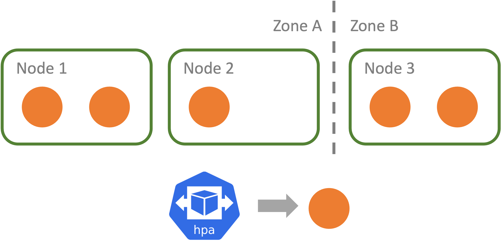

# S3
## Overview
This example is inspired by a [conflicting topology spread constraints example](https://kubernetes.io/docs/concepts/scheduling-eviction/topology-spread-constraints/#example-conflicting-topologyspreadconstraints) in the official Kubernetes document. In this example, there are two pod constraints, yet these two can be conflicting to each other and causing pods to fail to be scheduled.

## Setup
There are 3 nodes in this cluster. The nodes are labeled with two groups, `zone:Zone A` and `zone:Zone B`. 
. 

One deployment is applied to the cluster with a pod topology spread constraints are configured as follows. There are two constraints: the replicas should not skew more than 1 across all the nodes, and the replicas should not skew more than 1 across all the zones. If these constraints cannot meet, the replica cannot be scheduled. As shown in the above figure, these constraints are retained for 5 replicas. 
```
topologySpreadConstraints:
  - maxSkew: 1
    topologyKey: zone
    whenUnsatisfiable: DoNotSchedule
    labelSelector:
      matchLabels:
        run: php-apache
  - maxSkew: 1
    topologyKey: node
    whenUnsatisfiable: DoNotSchedule
    labelSelector:
      matchLabels:
        run: php-apache
```
The deployment is configured with an HPA, with the target of 50% CPU usage and max replicas 6, as configured in the following.
```
kubectl autoscale deployment php-apache --cpu-percent=50 --min=1 --max=6
```

## How it can go wrong
When the CPU utilization of pods go up to more than 50% requested, which may be due to request increases, the HPA can start to scale up the pods to the maximum of 6 replicas. When such 6th pod is created by the deployment controller, the scheduler need to place such pod onto the cluster; however, the pod cannot be placed on Node 1 or Node 2 as it will violate the Zone constraint, and the pod cannot be placed on Node 3 as it will violate the Node constraint. 

This will result in the situation that the pod cannot be scheduled and stays in the pending phase. The service capacity can be affected if new pods cannot be added to the application.
